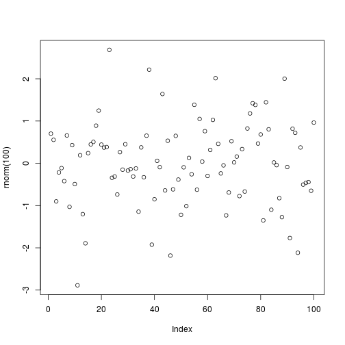
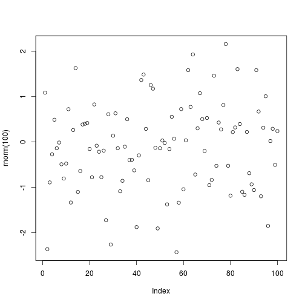
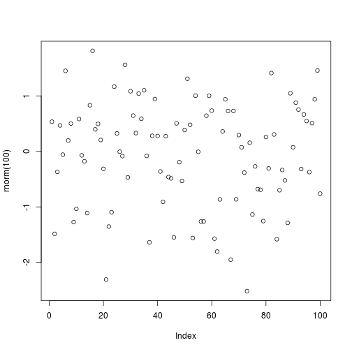
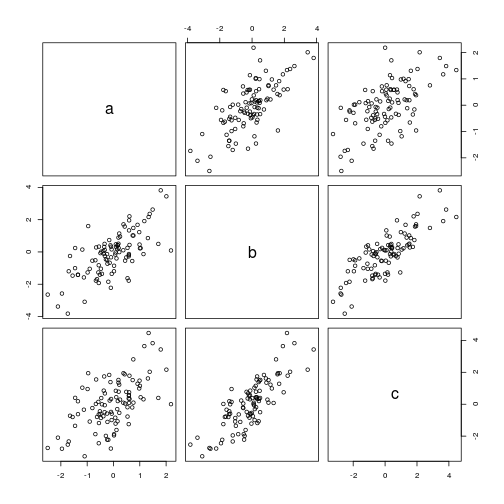
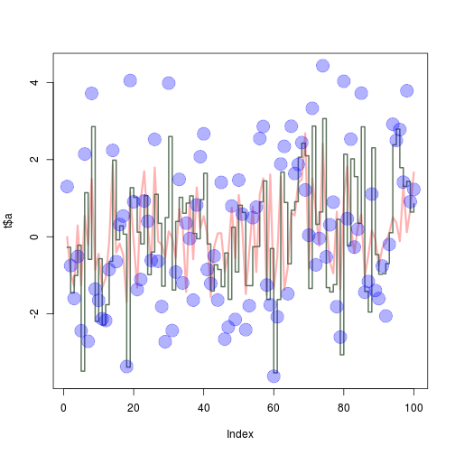

The objective of this assignment is to complete all the ToDo's in the document: A short introduction to R.

Document:https://cran.r-project.org/doc/contrib/Torfs+Brauer-Short-R-Intro.pdf

1. Compute the difference between 2014 and the year  you  started  at  this  university  and  divide this by the difference between 2014 and the year you  were  born.   Multiply  this with 100  to  get the  percentage  of  your  life  you  have  spent  at this university.  Use brackets if you need them.

```r
# What the question is telling me to do:
((2014-2014)/(2014-1995))*100
```

```
## [1] 0
```

```r
# What  makes sense if we calculate using the current year:
((2016-2014)/(2016-1995))*100
```

```
## [1] 9.52381
```

2. Repeat  the  previous  ToDo,  but  with  several steps  in  between.   You  can  give  the variables any name you want, but the name has to start with a letter.


```r
curYear=2016
startYear=2014
bornYear=1995
((curYear-startYear)/(curYear-bornYear))*100
```

```
## [1] 9.52381
```

3. Compute the sum of 4, 5, 8 and 11 by first combining  them  into  a  vector  and  then using  the function sum.


```r
compute=c(4,5,8,11)
sum(compute)
```

```
## [1] 28
```

4. Plot 100 normal random numbers


```r
plot(rnorm(100))
```



5. Find help for the sqrt function.

```r
help(sqrt)
```

6. Make a file called firstscript.R containing R-code  that  generates  100  random  numbers and plots them, and run this script several times.


```r
for (i in 1:4){
  plot(rnorm(100))
}
```



7. Put  the  numbers  31  to  60  in  a  vector  named P and in a matrix with 6 rows and 5 columns.

```r
p=seq(31,60)
q=matrix(data=p,ncol=5,nrow=6)
q
```

```
##      [,1] [,2] [,3] [,4] [,5]
## [1,]   31   37   43   49   55
## [2,]   32   38   44   50   56
## [3,]   33   39   45   51   57
## [4,]   34   40   46   52   58
## [5,]   35   41   47   53   59
## [6,]   36   42   48   54   60
```

8.Make  a  script  file  which  constructs  three  random  normal  vectors  of  length  100. Call  these vectors x1, x2 and x3. Make a data frame called t with three columns (called a, b and c ) containing  respectively x1, x1+x2 and x1+x2+x3.


```r
x1=rnorm(100)
x2=rnorm(100)
x3=rnorm(100)
t=data.frame (a = c(x1), b=c(x1+x2), c=c(x1+x2+x3))
plot(t)
```



```r
#sd can only accept vectors
sd(t$a+t$b+t$c)
```

```
## [1] 3.619028
```

9.Add these lines to the script le of the previous section.  Try to find out, either by experimenting or by using the help, what the meaning is of rgb the last argument of rgb, lwd, pch, cex.

rgb:alows you o specify a cl red, green, and blue values to create colour. It also alows you to vary colour intensity.
lwd:specifies a value for the line width
pch:specifies the symbol to use for plotting
cex:a value to specify the magnification of the plotting text and symbols

```r
x1=rnorm(100)
x2=rnorm(100)
x3=rnorm(100)
t=data.frame (a = c(x1), b=c(x1+x2), c=c(x1+x2+x3))
plot(t)
```


```r
#sd can only accept vectors
sd(t$a+t$b+t$c)
```

```
## [1] 3.943999
```

```r
plot(t$a, type="l", ylim=range(t), lwd=3, col=rgb(1,0,0,0.3))
lines(t$b, type="s", lwd=2, col=rgb(0.3,0.4,0.3,0.9))
points(t$c, pch=20, cex=4,col=rgb(0,0,1,0.3))
```



10. Make  a  file  called tst1.txt in  Notepad  from the  example  in  Figure  4  and  store it in  your working directory.  Write a script to read it, to multiply the column called g by 5 and to store it as tst2.txt.


```r
raed=read.table(file="~/SRT411/tst1.txt", header=TRUE)
y=raed$g * 5
write.table(y, file="~/SRT411/tst2.txt",row.names=FALSE)
y
```

```
## [1]  10  20  40  80 160 320
```

11.Compute the mean of the square root of a vector  of  100  random  numbers.


```r
l=abs(rnorm(100))
mean(l)
```

```
## [1] 0.7766485
```

12.Make  a  graph  with  on  the  x-axis:  today,  Sinterklaas  2014  and  your  next birthday  and  on the y-axis the number of presents you expect on each of these days.


```r
#wouldn't want to check  Sinterklaas for last year, we have to account for future presents
date=strptime( c("20160131120000","20161205000000", "20160919000000"),format="%Y%m%d%H%M%S")
presents = c(10,100,150)
plot (x=date,y=presents,xlab="date", ylab="presents")
```


13.Make a vector from 1 to 100.  Make a for-loop which runs through the whole vector. Multiply the elements which are smaller than 5 and larger than 90 with 10 and the other elements with 0.1.


```r
v=seq(1,100)
v2=c()
for(i in 1:100){
  if(v[i]<5 | v[i]>90){
    v2[i]=(v[i] * 10)
   } else{
    v2[i]=(v[i]* 0.1)
   }
}
print(v2)
```

```
##   [1]   10.0   20.0   30.0   40.0    0.5    0.6    0.7    0.8    0.9    1.0
##  [11]    1.1    1.2    1.3    1.4    1.5    1.6    1.7    1.8    1.9    2.0
##  [21]    2.1    2.2    2.3    2.4    2.5    2.6    2.7    2.8    2.9    3.0
##  [31]    3.1    3.2    3.3    3.4    3.5    3.6    3.7    3.8    3.9    4.0
##  [41]    4.1    4.2    4.3    4.4    4.5    4.6    4.7    4.8    4.9    5.0
##  [51]    5.1    5.2    5.3    5.4    5.5    5.6    5.7    5.8    5.9    6.0
##  [61]    6.1    6.2    6.3    6.4    6.5    6.6    6.7    6.8    6.9    7.0
##  [71]    7.1    7.2    7.3    7.4    7.5    7.6    7.7    7.8    7.9    8.0
##  [81]    8.1    8.2    8.3    8.4    8.5    8.6    8.7    8.8    8.9    9.0
##  [91]  910.0  920.0  930.0  940.0  950.0  960.0  970.0  980.0  990.0 1000.0
```

14. Write  a function  for  the  previous  ToDo, so that  you can feed  it  any vector you like (as  argument).Usea for-loop  in  the  function to do the computation  with  each  element. Use  the  standard  R  function length in the specification of the counter.


```r
func1 = function(v)
{
  v2=c()
  for(i in 1:length(v)){
    if(v[i]<5 | v[i]>90){
      v2[i]=(v[i] * 10)
    } else{
      v2[i]=(v[i]* 0.1)
    }
  }
  return(v2)
}
#run function
v1=seq(1,150)
func1(v1)
```

```
##   [1]   10.0   20.0   30.0   40.0    0.5    0.6    0.7    0.8    0.9    1.0
##  [11]    1.1    1.2    1.3    1.4    1.5    1.6    1.7    1.8    1.9    2.0
##  [21]    2.1    2.2    2.3    2.4    2.5    2.6    2.7    2.8    2.9    3.0
##  [31]    3.1    3.2    3.3    3.4    3.5    3.6    3.7    3.8    3.9    4.0
##  [41]    4.1    4.2    4.3    4.4    4.5    4.6    4.7    4.8    4.9    5.0
##  [51]    5.1    5.2    5.3    5.4    5.5    5.6    5.7    5.8    5.9    6.0
##  [61]    6.1    6.2    6.3    6.4    6.5    6.6    6.7    6.8    6.9    7.0
##  [71]    7.1    7.2    7.3    7.4    7.5    7.6    7.7    7.8    7.9    8.0
##  [81]    8.1    8.2    8.3    8.4    8.5    8.6    8.7    8.8    8.9    9.0
##  [91]  910.0  920.0  930.0  940.0  950.0  960.0  970.0  980.0  990.0 1000.0
## [101] 1010.0 1020.0 1030.0 1040.0 1050.0 1060.0 1070.0 1080.0 1090.0 1100.0
## [111] 1110.0 1120.0 1130.0 1140.0 1150.0 1160.0 1170.0 1180.0 1190.0 1200.0
## [121] 1210.0 1220.0 1230.0 1240.0 1250.0 1260.0 1270.0 1280.0 1290.0 1300.0
## [131] 1310.0 1320.0 1330.0 1340.0 1350.0 1360.0 1370.0 1380.0 1390.0 1400.0
## [141] 1410.0 1420.0 1430.0 1440.0 1450.0 1460.0 1470.0 1480.0 1490.0 1500.0
```

15. People  often  use  more  for-loops  than  necessary.The  ToDo  above  can  be done more easily and quickly without a for-loop but with regular vector computations.


```r
func2 = function(v){
  v2=ifelse(v<5 | v>90,v*10,v*0.1)
  return(v2)
}
#run =function
v1=seq(1,150)
func2(v1)
```

```
##   [1]   10.0   20.0   30.0   40.0    0.5    0.6    0.7    0.8    0.9    1.0
##  [11]    1.1    1.2    1.3    1.4    1.5    1.6    1.7    1.8    1.9    2.0
##  [21]    2.1    2.2    2.3    2.4    2.5    2.6    2.7    2.8    2.9    3.0
##  [31]    3.1    3.2    3.3    3.4    3.5    3.6    3.7    3.8    3.9    4.0
##  [41]    4.1    4.2    4.3    4.4    4.5    4.6    4.7    4.8    4.9    5.0
##  [51]    5.1    5.2    5.3    5.4    5.5    5.6    5.7    5.8    5.9    6.0
##  [61]    6.1    6.2    6.3    6.4    6.5    6.6    6.7    6.8    6.9    7.0
##  [71]    7.1    7.2    7.3    7.4    7.5    7.6    7.7    7.8    7.9    8.0
##  [81]    8.1    8.2    8.3    8.4    8.5    8.6    8.7    8.8    8.9    9.0
##  [91]  910.0  920.0  930.0  940.0  950.0  960.0  970.0  980.0  990.0 1000.0
## [101] 1010.0 1020.0 1030.0 1040.0 1050.0 1060.0 1070.0 1080.0 1090.0 1100.0
## [111] 1110.0 1120.0 1130.0 1140.0 1150.0 1160.0 1170.0 1180.0 1190.0 1200.0
## [121] 1210.0 1220.0 1230.0 1240.0 1250.0 1260.0 1270.0 1280.0 1290.0 1300.0
## [131] 1310.0 1320.0 1330.0 1340.0 1350.0 1360.0 1370.0 1380.0 1390.0 1400.0
## [141] 1410.0 1420.0 1430.0 1440.0 1450.0 1460.0 1470.0 1480.0 1490.0 1500.0
```

------------------------------------------------------------------------------------------------------------------
Sources:

http://www.cyclismo.org/tutorial/R/basicOps.html

https://cran.r-project.org/

http://www.r-bloggers.com/for-loops-and-how-to-avoid-them/

http://www.statmethods.net/management/operators.html
